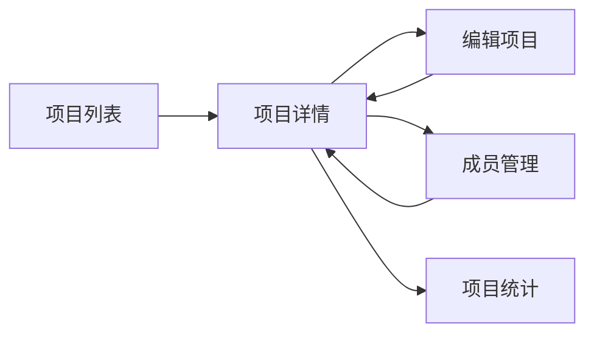

# 审计数智析 - 开发路线图

## 🎯 功能模块合并策略

基于业务强关联性，将原来零散的功能点合并为**5大开发包**，每个包内的功能紧密关联，可以一次性开发完成。

---

## 📦 开发包一：项目全生命周期管理

**包含功能**: 项目详情 + 项目编辑 + 成员管理 + 项目统计  
**开发优先级**: ⭐⭐⭐⭐⭐ (最高)  
**预计工时**: 5天  
**业务价值**: 核心入口，所有功能的基础

### 功能关联性分析



### 合并后的开发任务

#### 任务包 1.1：项目详情页（核心页面）

**文件**: `src/pages/project/detail.vue`

```vue
<template>
  <view class="project-detail">
    <!-- 头部信息卡片 -->
    <ProjectHeader :project="project" @edit="handleEdit" />
    
    <!-- 统计数据 -->
    <StatisticsCards :statistics="project.statistics" />
    
    <!-- 标签页切换 -->
    <Tabs v-model="activeTab">
      <TabPane name="workpaper" label="底稿">
        <WorkpaperList :projectId="projectId" />
      </TabPane>
      
      <TabPane name="members" label="成员">
        <MemberManager :projectId="projectId" :members="project.members" />
      </TabPane>
      
      <TabPane name="timeline" label="动态">
        <ProjectTimeline :projectId="projectId" />
      </TabPane>
      
      <TabPane name="settings" label="设置">
        <ProjectSettings :project="project" />
      </TabPane>
    </Tabs>
  </view>
</template>
```

**包含组件**:
- [x] `ProjectHeader.vue` - 项目头部信息
- [ ] `StatisticsCards.vue` - 统计卡片（待创建）
- [ ] `WorkpaperList.vue` - 底稿列表（待创建）
- [ ] `MemberManager.vue` - 成员管理（待创建）
- [ ] `ProjectTimeline.vue` - 项目动态（待创建）
- [ ] `ProjectSettings.vue` - 项目设置（待创建）

#### 任务包 1.2：项目表单（创建+编辑复用）

**文件**: `src/components/project/ProjectForm.vue`

```typescript
<script setup lang="ts">
interface Props {
  project?: Project;  // 编辑时传入，创建时为空
  mode: 'create' | 'edit';
}

const formData = ref({
  name: '',
  client: '',
  type: 'annual_audit',
  description: '',
  startDate: '',
  endDate: ''
});

const handleSubmit = async () => {
  if (props.mode === 'create') {
    await projectApi.createProject(formData.value);
  } else {
    await projectApi.updateProject(props.project!.id, formData.value);
  }
};
</script>
```

#### 任务包 1.3：成员管理（集成在详情页）

**文件**: `src/components/project/MemberManager.vue`

```typescript
// 功能：
// 1. 显示成员列表（头像、姓名、角色）
// 2. 添加成员（搜索用户 + 分配角色）
// 3. 修改角色
// 4. 移除成员
// 5. 权限控制（只有管理员可以操作）
```

### 开发检查清单

- [ ] **Day 1**: 项目详情页布局 + API集成
- [ ] **Day 2**: 统计卡片 + 底稿列表预览
- [ ] **Day 3**: 项目表单组件（创建+编辑）
- [ ] **Day 4**: 成员管理功能
- [ ] **Day 5**: 项目设置 + 测试联调

### API接口清单

```typescript
// 一次性实现所有相关接口
GET    /projects/:id                    // 获取详情
PUT    /projects/:id                    // 更新项目
DELETE /projects/:id                    // 删除项目
GET    /projects/:id/statistics         // 获取统计
GET    /projects/:id/members            // 获取成员
POST   /projects/:id/members            // 添加成员
PUT    /projects/:id/members/:userId    // 修改角色
DELETE /projects/:id/members/:userId    // 移除成员
GET    /projects/:id/timeline           // 获取动态
```

---

## 📦 开发包二：底稿节点引擎

**包含功能**: 底稿CRUD + 节点编辑器 + 节点关系 + 节点AI分析  
**开发优先级**: ⭐⭐⭐⭐⭐ (最高)  
**预计工时**: 7天  
**业务价值**: 系统核心竞争力

### 功能关联性分析

```
底稿 → 节点 → AI分析
  ├── 创建底稿
  ├── 添加节点
  ├── 编辑节点内容
  ├── 连接节点
  └── AI分析节点
```

### 合并后的架构设计

#### 核心组件树

```
WorkpaperDetail.vue (底稿详情页)
├── WorkpaperToolbar.vue (工具栏)
├── NodeCanvas.vue (节点画布)
│   ├── NodeItem.vue (节点组件)
│   │   ├── NodeHeader
│   │   ├── NodeContent
│   │   └── NodePorts (连接点)
│   └── NodeConnection.vue (连线)
├── NodeEditor.vue (节点编辑器 - 抽屉)
│   ├── RichTextEditor (富文本)
│   ├── TableEditor (表格)
│   └── FormulaEditor (公式)
└── AIAnalysisPanel.vue (AI分析面板)
    ├── AnalysisProgress
    ├── AnalysisResult
    └── ActionButtons
```

### 开发检查清单

#### Week 1: 底稿与节点基础

- [ ] **Day 1-2**: 底稿详情页 + 节点数据结构
  ```typescript
  // src/types/workpaper.ts
  interface WorkpaperNode {
    id: string;
    type: 'voucher' | 'invoice' | 'analysis';
    position: { x: number; y: number };
    data: {
      title: string;
      content: ContentBlock[];
    };
    inputs: Connection[];
    outputs: Connection[];
  }
  ```

- [ ] **Day 3-4**: 节点画布渲染（Canvas/SVG）
  - 节点拖拽
  - 缩放平移
  - 连线绘制

- [ ] **Day 5**: 节点编辑器（富文本 + 表格）
  - TinyMCE 或 Quill 集成
  - 表格编辑功能

#### Week 2: 节点关系与AI

- [ ] **Day 6**: 节点连接逻辑
  - 拖拽连线
  - 连接验证
  - 数据流

- [ ] **Day 7**: AI分析集成
  - 调用千问API
  - 结果解析
  - 结果展示

### 技术选型

**节点画布方案**:
```typescript
// 推荐使用 @antv/g6 或自研Canvas方案
import G6 from '@antv/g6';

const graph = new G6.Graph({
  container: 'canvas',
  width: 800,
  height: 600,
  modes: {
    default: ['drag-canvas', 'drag-node']
  }
});
```

---

## 📦 开发包三：证据智能管理

**包含功能**: 证据上传 + 预览 + OCR识别 + 智能分类  
**开发优先级**: ⭐⭐⭐⭐ (高)  
**预计工时**: 4天  
**业务价值**: 提升审计效率的关键

### 功能流程图

```
选择文件 → 预览 → 上传 → OCR识别 → 智能分类 → 关联底稿
```

### 合并后的页面设计

#### 证据上传页（一体化）

**文件**: `src/pages/evidence/upload.vue`

```vue
<template>
  <view class="evidence-upload">
    <!-- Step 1: 文件选择 -->
    <FileSelector 
      v-if="step === 1"
      @select="handleFileSelect"
      :multiple="true"
      :max-count="20"
    />
    
    <!-- Step 2: 批量预览 -->
    <FilePreview
      v-if="step === 2"
      :files="selectedFiles"
      @confirm="handleUpload"
      @remove="handleRemove"
    />
    
    <!-- Step 3: 上传进度 -->
    <UploadProgress
      v-if="step === 3"
      :files="uploadingFiles"
      :progress="uploadProgress"
    />
    
    <!-- Step 4: OCR识别 -->
    <OCRRecognition
      v-if="step === 4"
      :evidences="uploadedEvidences"
      @complete="handleOCRComplete"
    />
    
    <!-- Step 5: 分类归档 -->
    <EvidenceClassify
      v-if="step === 5"
      :evidences="recognizedEvidences"
      @save="handleSave"
    />
  </view>
</template>
```

### 开发检查清单

- [ ] **Day 1**: 文件上传组件（支持多选、拖拽、压缩）
- [ ] **Day 2**: 预览功能（图片、PDF、文档）
- [ ] **Day 3**: OCR集成（腾讯云API）
- [ ] **Day 4**: 智能分类 + 批量操作

### OCR集成代码

```typescript
// src/services/ocr.service.ts
import crypto from 'crypto-js';

export class OCRService {
  private static readonly APP_ID = import.meta.env.VITE_TENCENT_APP_ID;
  private static readonly SECRET_KEY = import.meta.env.VITE_TENCENT_SECRET_KEY;
  
  /**
   * 发票识别
   */
  static async recognizeInvoice(imageUrl: string) {
    const response = await fetch('https://ocr.tencentcloudapi.com', {
      method: 'POST',
      headers: {
        'Content-Type': 'application/json',
        'Authorization': this.generateAuth()
      },
      body: JSON.stringify({
        Action: 'VatInvoiceOCR',
        Version: '2018-11-19',
        ImageUrl: imageUrl
      })
    });
    
    return response.json();
  }
  
  /**
   * 凭证识别（通用OCR）
   */
  static async recognizeVoucher(imageUrl: string) {
    // 实现凭证识别逻辑
  }
  
  private static generateAuth(): string {
    // 生成腾讯云签名
    const timestamp = Math.floor(Date.now() / 1000);
    const nonce = Math.random().toString(36).substring(2);
    // ... 签名逻辑
    return `TC3-HMAC-SHA256 ${signature}`;
  }
}
```

---

## 📦 开发包四：AI智能分析引擎

**包含功能**: 节点分析 + 风险评估 + 异常检测 + 智能建议  
**开发优先级**: ⭐⭐⭐⭐ (高)  
**预计工时**: 4天  
**业务价值**: 核心卖点

### AI分析流程

```
触发分析 → 收集上下文 → 构建Prompt → 调用千问 → 解析结果 → 展示建议
```

### Prompt工程

```typescript
// src/config/ai-prompts.ts

export const AIPrompts = {
  // 风险评估Prompt
  riskAssessment: (context: AnalysisContext) => `
你是一名资深审计师，请分析以下审计节点的风险情况：

【项目信息】
- 客户：${context.project.client}
- 项目类型：${context.project.type}

【节点信息】
- 节点类型：${context.node.type}
- 节点内容：${context.node.content}

【关联证据】
${context.evidences.map(e => `- ${e.title}: ${e.ocrResult?.summary}`).join('\n')}

请从以下角度进行分析：
1. 识别潜在风险点（高/中/低）
2. 分析异常情况
3. 提供审计建议
4. 指出需要关注的细节

以JSON格式返回：
{
  "riskLevel": "high|medium|low",
  "findings": [
    {"title": "", "severity": "", "description": ""}
  ],
  "suggestions": [""],
  "confidence": 0.85
}
`,

  // 异常检测Prompt
  anomalyDetection: (context: AnalysisContext) => `
请检测以下数据中的异常情况：

【数据内容】
${JSON.stringify(context.data, null, 2)}

【检测维度】
- 金额异常
- 时间异常
- 逻辑异常
- 完整性异常

返回检测结果...
`,

  // 智能总结Prompt
  summary: (context: AnalysisContext) => `
请总结以下审计工作：

【工作内容】
${context.workContent}

【关键发现】
${context.findings}

生成简洁的审计总结...
`
};
```

### 千问API封装

```typescript
// src/services/ai.service.ts

export class AIService {
  private static readonly API_KEY = import.meta.env.VITE_QWEN_API_KEY;
  private static readonly API_URL = 'https://dashscope.aliyuncs.com/api/v1/services/aigc/text-generation/generation';
  
  /**
   * 调用千问API
   */
  static async chat(prompt: string, model = 'qwen-max'): Promise<string> {
    const response = await fetch(this.API_URL, {
      method: 'POST',
      headers: {
        'Content-Type': 'application/json',
        'Authorization': `Bearer ${this.API_KEY}`
      },
      body: JSON.stringify({
        model,
        input: {
          messages: [
            { role: 'system', content: '你是一名资深审计师' },
            { role: 'user', content: prompt }
          ]
        },
        parameters: {
          temperature: 0.7,
          top_p: 0.8,
          max_tokens: 2000
        }
      })
    });
    
    const data = await response.json();
    return data.output.text;
  }
  
  /**
   * 分析节点
   */
  static async analyzeNode(context: AnalysisContext): Promise<AIAnalysisResult> {
    // 1. 构建Prompt
    const prompt = AIPrompts.riskAssessment(context);
    
    // 2. 调用API
    const response = await this.chat(prompt);
    
    // 3. 解析结果
    try {
      return JSON.parse(response);
    } catch (error) {
      // 如果AI没有返回JSON，手动解析
      return this.parseTextResponse(response);
    }
  }
  
  /**
   * 批量分析
   */
  static async batchAnalyze(contexts: AnalysisContext[]): Promise<AIAnalysisResult[]> {
    return Promise.all(contexts.map(ctx => this.analyzeNode(ctx)));
  }
}
```

### 开发检查清单

- [ ] **Day 1**: Prompt模板设计 + AI服务封装
- [ ] **Day 2**: 分析结果解析 + 缓存机制
- [ ] **Day 3**: AI分析UI组件
- [ ] **Day 4**: 批量分析 + 性能优化

---

## 📦 开发包五：协作审批系统

**包含功能**: 评论 + 任务 + 审批流程 + 通知  
**开发优先级**: ⭐⭐⭐ (中)  
**预计工时**: 6天  
**业务价值**: 提升团队协作效率

### 功能关联图

```
评论系统 ←→ 任务管理 ←→ 审批流程 ←→ 消息通知
```

### 开发检查清单

- [ ] **Day 1-2**: 评论组件（@提醒、富文本、表情）
- [ ] **Day 3-4**: 任务管理（创建、分配、跟踪）
- [ ] **Day 5-6**: 审批流程引擎

---

## 📅 6周开发计划

### Week 1-2: 核心业务闭环
- ✅ 项目全生命周期管理（5天）
- ⏳ 底稿节点引擎 Part1（5天）

### Week 3-4: 智能化升级
- ⏳ 底稿节点引擎 Part2（2天）
- ⏳ 证据智能管理（4天）
- ⏳ AI分析引擎（4天）

### Week 5-6: 协作完善
- ⏳ 协作审批系统（6天）
- ⏳ 性能优化（2天）
- ⏳ 测试与文档（2天）

---

## 🎯 里程碑

### M1: MVP可用版（Week 2结束）
- [x] 项目管理完整
- [ ] 底稿基本功能
- [ ] 可演示完整流程

### M2: 智能化版（Week 4结束）
- [ ] 证据自动识别
- [ ] AI分析可用
- [ ] 核心功能完整

### M3: 协作版（Week 6结束）
- [ ] 团队协作完整
- [ ] 审批流程可用
- [ ] 可正式上线

---

**文档版本**: v1.0  
**创建日期**: 2024-11-28
